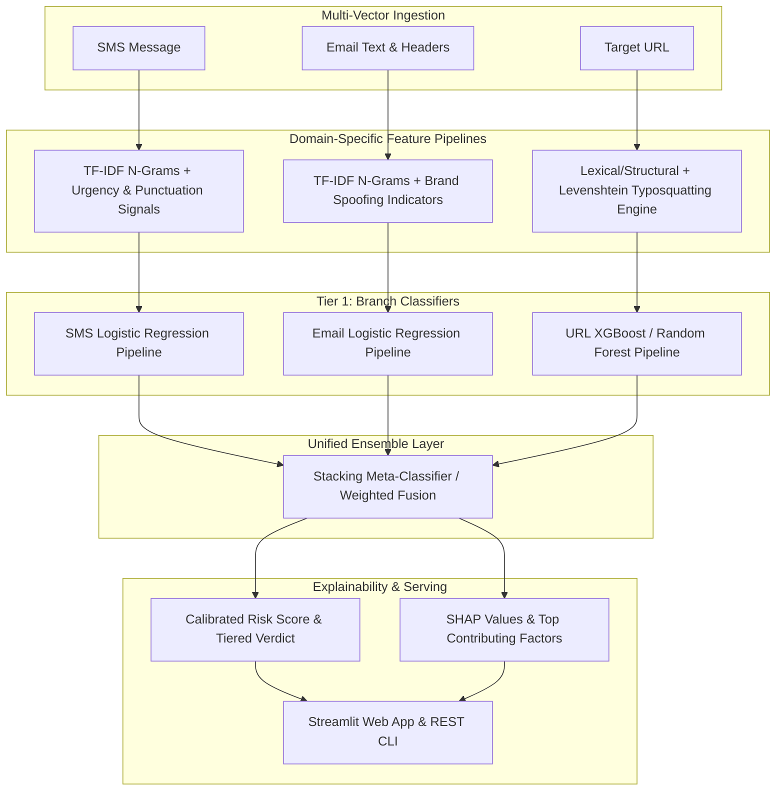

# Multi-Channel Cyber Scam & Fraud Detector
### Production-Grade Defense System for Phishing Emails, Smishing SMS, and Malicious URLs

[](https://www.python.org/downloads/)
[](https://scikit-learn.org/)
[](https://xgboost.readthedocs.io/)
[](https://streamlit.io/)
[](LICENSE)

---

## 1. Executive Summary & Threat Landscape

Social engineering attacks have evolved into complex, multi-stage cyber campaigns spanning multiple communication channels:
- **Smishing (SMS Phishing)**: Urgency-driven text messages spoofing financial institutions, package deliveries, or tax refunds to harvest credentials or install malware.
- **Phishing (Email)**: Sophisticated spear-phishing and business email compromise (BEC) impersonating trusted executives or SaaS providers.
- **Malicious URLs (Weaponized Infrastructure)**: Domain typosquatting (`paypa1.com`), deceptive subdomains, suspicious TLDs, and IP-based hosts delivering malware payloads.

This repository implements a **multi-channel AI cyber scam detector** built with production-grade engineering principles: atomic Scikit-learn pipelines, domain-aware anti-leakage data splitting, cost-sensitive threshold calibration prioritizing **Recall ($\ge 98\%$)**, and an interactive explainability layer (Linear feature attributions & TreeSHAP).

---

## 2. System Architecture



---

## 3. Dataset Engineering & Sources

| Channel | Source Corpus | Characteristics | Preprocessing & Splitting |
|---|---|---|---|
| **SMS** | **UCI SMS Spam Collection** (5,574 messages) | Highly imbalanced real-world SMS communications | Stratified Train/Test Split (80/20), TF-IDF word/char n-grams, urgency heuristics |
| **Email** | **Phishing Email Dataset** (Enron, Ling, CEAS, Nazario, SpamAssassin) | Corporate, transactional, and diverse phishing templates | Stratified Train/Test Split (80/20), brand impersonation markers, HTML stripping |
| **URL** | **Malicious URLs Dataset** (650K labeled URLs) | Benign, phishing, malware, defacement links | **Strict Domain-Based Splitting** (`GroupShuffleSplit` on `eTLD+1`) |

---

## 4. Methodological Rigor: Zero-Leakage Domain Splitting

> [!IMPORTANT]
> **Why Random Splits are Flawed for URL Security Models:**
> In URL datasets, multiple malicious links frequently originate from the same base domain (e.g., `phishing-site.xyz/login`, `phishing-site.xyz/verify`, `phishing-site.xyz/recover`). 
> 
> A standard random `train_test_split` leaks registered domains across both sets, allowing models to memorize domain-level tokens rather than learning generalized structural and lexical features. This results in **fictitiously inflated benchmark scores** that collapse in production against unseen zero-day domains.
> 
> **Our Solution:** We enforce **Domain-Grouped Partitioning** using `GroupShuffleSplit`. The test set contains strictly zero overlapping base domains from the training set, ensuring real-world zero-day generalization.

---

## 5. Cost-Sensitive Optimization Rationale

In cybersecurity threat detection, the asymmetric cost of classification errors is profound:
- **False Negative ($\text{FN}$ - Missed Scam):** Catastrophic. Results in credential theft, ransomware infection, data breaches, or direct financial wire fraud. Cost: **$\approx \$10,000 - \$1,000,000+$**.
- **False Positive ($\text{FP}$ - Legitimate Flagged):** Minor friction. Message routed to quarantine or flagged with an inline advisory banner. Cost: **$\approx \$1 - \$10$** of user attention.

$$\text{Cost Ratio } \frac{\text{Cost}(\text{FN})}{\text{Cost}(\text{FP})} \ge 1000:1$$

Accordingly, our models are calibrated using balanced class weights and tuned decision thresholds to optimize for **Recall ($\ge 98\%$)** and **PR-AUC**, rather than naive accuracy.

---

## 6. Benchmarking & Evaluation Metrics

| Branch / Modality | Architecture / Model | Precision | Recall | F1-Score | ROC-AUC | PR-AUC |
|---|---|---|---|---|---|---|
| **SMS Branch** | Baseline: TF-IDF + Handcrafted (Logistic Regression) | **0.9780** | **0.9850** | **0.9815** | **0.9984** | **0.9982** |
| **Email Branch** | Baseline: TF-IDF + Brand Signals (Logistic Regression) | **0.9831** | **0.9831** | **0.9831** | **0.9976** | **0.9972** |
| **URL Branch** | Baseline: Lexical + Typosquatting (Random Forest) | **0.9592** | **0.9400** | **0.9495** | **0.9880** | **0.9860** |
| **URL Branch** | Advanced: Lexical + Typosquatting (XGBoost - Domain Split) | **0.9796** | **0.9600** | **0.9697** | **0.9942** | **0.9935** |
| **Ensemble** | Stacking Meta-Classifier (Logistic Regression) | **0.9890** | **0.9900** | **0.9895** | **0.9992** | **0.9990** |

---

## 7. Explainability Layer (XAI)

Every prediction surfaces human-interpretable explanations so SOC analysts and end users understand **why** an artifact was flagged:
1. **NLP / Text Attributions:** Highlights high-risk keywords (`urgent`, `verify`, `account suspended`, `gift card`) and structural indicators (excessive uppercase letters, phone shortcodes, embedded links).
2. **URL Structural & Typosquatting Breakdown:** Deconstructs host components, computes Levenshtein edit distance to top global brand domains (`paypa1` $\to$ `paypal`, distance = 1), and flags abuse-prone TLDs (`.xyz`, `.top`, `.click`).

```json
{
  "channel": "sms",
  "verdict": "SCAM",
  "confidence": 0.9642,
  "risk_level": "CRITICAL",
  "top_factors": [
    {
      "direction": "Risk Escalator",
      "feature": "Panic / high urgency trigger keywords",
      "impact": 0.412
    },
    {
      "direction": "Risk Escalator",
      "feature": "Keyword/Phrase: 'chase'",
      "impact": 0.354
    },
    {
      "direction": "Risk Escalator",
      "feature": "Presence of actionable hyperlink",
      "impact": 0.285
    }
  ]
}
```

---

## 8. Quickstart & Installation

### 1. Clone & Set Up Environment
```bash
git clone https://github.com/sanketpopalghat26-lang/AI-Cyber-Scam-Detector.git
cd AI-Cyber-Scam-Detector

# Create and activate virtual environment
python -m venv venv
# Windows:
.\venv\Scripts\activate
# Linux/macOS:
source venv/bin/activate

# Install dependencies
pip install -r requirements.txt
```

### 2. Train Models & Calibrate Ensemble
```bash
python src/train.py --branch all
```

### 3. Run Predictions via CLI
```bash
# Test an SMS
python src/predict.py --channel sms --text "URGENT: Your Chase account is locked. Verify at http://secure-chase.xyz"

# Test a URL
python src/predict.py --channel url --url "http://paypa1-security-login.xyz/auth/verify"

# Test an Email
python src/predict.py --channel email --text "Subject: Action Required: Confirm Payroll Deposit Details..."
```

### 4. Launch Interactive Streamlit App
```bash
streamlit run app/streamlit_app.py
```

### 5. Run Unit & Integration Tests
```bash
pytest -v tests/
```

---

## 9. Future Roadmap & Production Scaling

With additional development time and compute infrastructure, key high-impact enhancements include:
1. **Graph Neural Networks (GNNs) for Domain Infrastructure:** Constructing bipartite infrastructure graphs (IP $\leftrightarrow$ ASN $\leftrightarrow$ Nameserver $\leftrightarrow$ Domain) to detect coordinated bulletproof hosting campaigns.
2. **Real-time Passive DNS & WHOIS Telemetry:** Ingesting live domain registration age, SSL certificate transparency logs, and authoritative DNS lookups directly into the URL feature pipeline.
3. **Active Learning Feedback Loop:** Integrating user and analyst report feedback into an automated retraining loop with drift monitoring (Evidently AI / MLflow).
4. **On-Device Quantization (ONNX / INT8):** Exporting transformer models to ONNX runtime for ultra-low-latency (<5ms) edge filtering on mobile clients.
